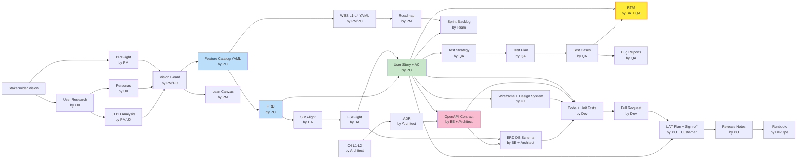

<div align="center">

# CSK CLI

**Company Skill Kit — Install, manage, and trace deliverables for Inception-Driven Standard Agile**

[](https://github.com/EIgentLab/csk-cli/blob/main/LICENSE)
[](https://go.dev/)

[Install](#install) · [Quick Start](#quick-start) · [Commands](#commands) · [Workflow Guide](#workflow-guide) · [Document Lineage](#document-lineage) · [Skills & Agents](#skills--agents) · [Deliverables Index](#deliverables-index) · [Development](#development)

</div>

---

## What is CSK CLI?

`csk` is the command-line companion to the **Company Skill Kit (CSK)** — a suite of 36 skills + 10 role-based agents that power the **Inception-Driven Standard Agile** workflow for small teams (8-10 people).

| Capability | What it means |
|---|---|
| **Install & manage** | Ships embedded skills/agents — `csk install` drops them into `.claude/` so Claude Code can use them instantly |
| **Deliverables index** | Scans `.project/deliverables/`, builds a CSV index of every artifact (PRD, SRS, ADR, …) with frontmatter, cross-refs, and traceability |
| **Visualization & search** | Ripgrep-powered search, Mermaid diagram generation (graph / RTM / trace), orphan detection, ref validation — all from the CLI |

---

## Install

### macOS / Linux — curl

```bash
curl -fsSL https://raw.githubusercontent.com/EIgentLab/csk-cli/dev-v1/scripts/install.sh | bash
```

Installs to `~/.local/bin` (no `sudo` required). Automatically adds `~/.local/bin` to your shell `PATH` using idempotent block markers.

System-wide install:

```bash
curl -fsSL https://raw.githubusercontent.com/EIgentLab/csk-cli/dev-v1/scripts/install.sh | bash -s -- --install-dir /usr/local/bin
```

Skip auto-add to `PATH` or install a specific version:

```bash
curl -fsSL ... | bash -s -- --no-add-path
curl -fsSL ... | bash -s -- --version v0.1.0-alpha.1
```

### macOS / Linux — Homebrew

```bash
brew tap eigentlab/csk-cli https://github.com/EIgentLab/csk-cli
brew install csk
```

### Windows — Scoop

```powershell
scoop bucket add eigentlab https://github.com/EIgentLab/csk-cli
scoop install csk
```

### Manual download

Grab the binary for your platform from the [Releases](https://github.com/EIgentLab/csk-cli/releases) page.

### Verify

```bash
csk version
```

---

## Quick Start

```bash
csk install              # Install skills + agents into ./.claude/
csk install -g           # … or globally into ~/.claude/
csk list                 # Show what was installed
csk db rebuild           # Build deliverables index (required before search/viz)
csk skills list          # Explore available skills
csk skills search "prd"  # Fuzzy search
```

---

## Commands

### Install & Manage

| Command | Description | Key flags |
|---|---|---|
| `csk install` | Install embedded skills & agents | `-g` global, `--keep` preserve conflicts |
| `csk uninstall` | Remove all installed assets | `-g` global |
| `csk update` | Re-install if binary version differs | `-g` global, `--dry-run` preview only |
| `csk list` | Show installed skills & agents from manifest | `-g` global |
| `csk version` | Print binary version | — |

### Deliverables Index

| Command | Description | Key flags |
|---|---|---|
| `csk db rebuild` | Scan `deliverables/` → regenerate `artifacts.csv` + `refs.csv` | `-v` verbose |
| `csk db verify` | Validate index integrity | — |
| `csk db stats` | Print artifact & ref statistics | — |
| `csk db list` | List artifacts by phase, status, or project | `--phase P0-P6`, `--status`, `--project`, `--json` |

### Search & Lookup

| Command | Description | Key flags |
|---|---|---|
| `csk find <id>` | Look up artifact by ID | `--full` include body, `--json` |
| `csk refs <id>` | List cross-references for an artifact | `--in` / `--out` / `--all`, `--json` |
| `csk orphans` | List artifacts with no incoming or outgoing refs | `--exclude-type`, `--include-all`, `--json` |
| `csk broken-refs` | Validate all refs | `--json` |
| `csk search "<query>"` | Ripgrep across deliverables | `--type`, `--status`, `--limit`, `--case-sensitive`, `--json` |

### Skills Registry

| Command | Description | Key flags |
|---|---|---|
| `csk skills list` | Enumerate installed skills | `--phase P0-P6`, `--owner`, `--json` |
| `csk skills search "<query>"` | Rank skills by keyword + phase + owner | `--phase`, `--owner`, `--limit`, `--json` |

### Visualization

| Command | Description | Key flags |
|---|---|---|
| `csk viz graph` | Mermaid flowchart of artifact references | `--type` filter, `--out` file |
| `csk viz rtm` | Mermaid RTM diagram | `--type` filter, `--out` file |
| `csk viz trace <id>` | Mermaid trace diagram from a single artifact | `--depth` max depth, `--out` file |
| `csk export` | Export deliverables index as HTML dashboard | `--html`, `--open`, `--out` path |

> **Deprecated aliases:** `csk graph` → `csk viz graph`, `csk rtm trace` → `csk viz trace`

### Watch Mode

| Command | Description | Key flags |
|---|---|---|
| `csk watch` | Monitor `deliverables/` for changes, auto-rebuild indexes | `-d` debounce ms, `-q` quiet |

---

## Workflow Guide

CSK CLI supports the **Inception-Driven Standard Agile** workflow — a 6-phase pipeline optimized for fixed-scope agency projects with teams of 8-10 people.

### Phase Pipeline

```
P0 Discovery → P1 Inception → P2 Definition+Design → P3 Planning → P4 Sprint Loop ◄─┐
                                                                          ▼              │
                                                                     P5 Release+UAT      │
                                                                          ▼              │
                                                                     P6 Maintenance ─────┘
```

### Commands by Phase

| Phase | Timebox | Key Commands | Deliverables |
|---|---|---|---|
| **P0 — Discovery** | 3-5 days | `csk skills list --phase P0` | Personas, Journey Map, JTBD |
| **P1 — Inception** | 5 days | `csk skills list --phase P1` | Vision Board, Feature Catalog, Lean Canvas |
| **P2 — Definition & Design** | 5-7 days | `csk skills list --phase P2` → `csk db rebuild` | PRD, SRS, FSD, OpenAPI, ADR, C4 L2, Wireframe, ERD |
| **P3 — Planning** | 2-3 days | `csk viz rtm` → `csk db verify` | WBS, Roadmap, Sprint Backlog, RTM seed |
| **P4 — Sprint Loop** | 2 wk × N | `csk watch` + `csk db rebuild` + `csk orphans` | User Stories, Test Cases, Burndown, RTM updates |
| **P5 — Release & UAT** | 1-2 wk | `csk broken-refs` + `csk viz trace` | UAT Sign-off, Release Notes, Runbook |
| **P6 — Maintenance** | Continuous | `csk search` + `csk find` | Incident Reports, Patch Notes |

### Typical Workflow Session

```bash
# After creating deliverables in P2:
csk db rebuild                          # Index all new artifacts
csk db list --phase P2                  # Verify P2 deliverables exist
csk broken-refs                         # Catch any missing cross-refs

# Visualize the full artifact graph:
csk viz graph --out docs/artifact-graph.mmd
csk viz rtm --out docs/rtm-diagram.mmd

# Trace a specific requirement through the pipeline:
csk viz trace FEAT-001 --depth 3

# During sprints, keep index fresh:
csk watch                               # Auto-rebuild on every .md save

# Before release, validate everything:
csk db verify                            # Check for drift
csk orphans                              # Find disconnected artifacts
```

---

<a id="document-lineage"></a>
## Document Lineage (RTM Backbone)

Every **upstream** document feeds into **downstream** documents via IDs — this is the **RTM (Requirements Traceability Matrix)** in action. Arrows = "derives from".



**RTM** (yellow) is the backbone: it links **User Story ↔ Test Case ↔ Code Commit ↔ UAT Result**. Every requirement has a test, every test traces back to a requirement.

### Phase → Document Mapping

| Phase | Upstream Inputs | Documents Created | Downstream Feeds |
|-------|----------------|-------------------|-----------------|
| **P0** | Contract/RFP | Personas, Journey Map, JTBD, User Research Report | P1 Vision |
| **P1** | P0 outputs | Vision Board, Feature Catalog (YAML), Lean Canvas, C4 L1 | P2 PRD/SRS |
| **P2** | P1 outputs | PRD, SRS-light, FSD-light, OpenAPI, ADR, C4 L2, Wireframe, ERD, Test Strategy | P3 WBS/RTM |
| **P3** | P2 outputs | WBS (YAML), Roadmap, Sprint Backlog, RTM seed | P4 Stories |
| **P4** | P3 outputs | User Stories + AC, Test Cases, Code, PRs, Burndown | P5 UAT |
| **P5** | P4 outputs | UAT Plan + Sign-off, Release Notes, Runbook | P6 Ops |
| **P6** | P5 outputs | Incident Reports, Patch Notes, SLA reports | P4 Backlog |

---

## Skills & Agents

### 10 Role-Based Agents

Installed to `.claude/agents/`:

| Agent | Role | Phase Ownership |
|---|---|---|
| `csk-po` | Product Owner | P1, P2, P4, P5 |
| `csk-pm` | Project Manager | P0, P3, P5, P6 |
| `csk-ba` | Business Analyst | P2, P4 |
| `csk-ux-ui` | UX/UI Designer | P0, P2 |
| `csk-architect` | Software Architect | P2 |
| `csk-tech-lead` | Tech Lead | P2, P4 |
| `csk-fullstack-dev` | Full-Stack Developer | P4 |
| `csk-qa` | QA Engineer | P2, P4, P5 |
| `csk-devops` | DevOps Engineer | P2, P4, P5, P6 |
| `csk-sm` | Scrum Master | P3, P4 |

### 36 Skills

Each skill is a `csk-{artifact}/SKILL.md` with template, guidelines, and examples. See [**SKILLS_REFERENCE.md**](./SKILLS_REFERENCE.md) for full details on every skill.

| Phase | Skills |
|---|---|
| **P0** | `csk-stakeholder-interview` · `csk-jtbd` · `csk-persona` · `csk-journey-map` · `csk-user-research` |
| **P1** | `csk-vision-board` · `csk-lean-canvas` · `csk-feature-catalog` |
| **P2** | `csk-prd` · `csk-srs` · `csk-fsd` · `csk-c4-l1` · `csk-c4-l2` · `csk-adr` · `csk-openapi` · `csk-erd` · `csk-wireframe` · `csk-wireflow` · `csk-design-system` · `csk-brand` · `csk-test-strategy` · `csk-test-plan` · `csk-test-cases` · `csk-rtm` |
| **P3** | `csk-wbs` · `csk-roadmap` · `csk-sprint-planning` · `csk-sprint-backlog` · `csk-raci` · `csk-risk-register` |
| **P4** | `csk-user-story` · `csk-bug-report` · `csk-validate` · `csk-revise` |
| **P5** | `csk-uat` |
| **Any** | `csk-conduct` (meta-router) · `csk-orchestrate` |

```bash
csk skills list                   # All skills
csk skills list --phase P2        # P2 Definition & Design only
csk skills list --owner architect # Architect-owned skills
csk skills search "test"          # Fuzzy search by keyword
```

---

## Deliverables Index

CSK CLI manages a structured deliverables directory with CSV-based indexing:

```
.project/deliverables/
├── _index/
│   ├── artifacts.csv       # id, type, version, status, path
│   └── refs.csv            # source_id, target_id, ref_type, source_file
├── p0-discovery/
│   ├── personas-v1.md
│   └── journey-map-v1.md
├── p1-inception/
│   ├── vision-board-v1.md
│   └── feature-catalog-v1.yaml
├── p2-definition/
│   ├── prd-v1.md
│   ├── srs-light-v1.md
│   ├── adr-001-postgresql.md
│   └── ...
└── ...
```

Each deliverable Markdown file uses CSK frontmatter:

```yaml
---
id: PRD-001
type: prd
version: "1.0"
status: approved
phase: P2
owners: [po]
upstream: [VISION-001, FCAT-001]
implements: [FEAT-001]
traces_to: [US-001, TC-001]
---
```

### Index Lifecycle

```bash
csk db rebuild          # Regenerate artifacts.csv + refs.csv
csk watch               # Auto-rebuild on file changes
csk db verify            # Check stale, broken-refs, bidirectional mismatches
csk broken-refs          # Standalone broken-refs check
csk orphans              # Find disconnected artifacts
```

---

## Development

### Prerequisites

- Go 1.26.3+
- GoReleaser v2 (for releases)

### Build

```bash
make build              # Standard build
make garble             # Garble obfuscated build
make clean              # Remove artifacts
make release-snapshot   # Test GoReleaser locally
```

### Release Pipeline

1. Push a tag (`v*`) to `csk-cli`
2. GitHub Actions triggers GoReleaser
3. Binaries built for 5 platforms
4. Releases + Homebrew formula + Scoop manifest cross-pushed

### Project Structure

```
csk-cli/                          # This repo — distribution & installers
├── Formula/csk.rb                # Homebrew formula template
├── Bucket/csk.json               # Scoop manifest template
├── scripts/install.sh            # curl installer script
└── LICENSE
```

---

## License

BUSL-1.1 (Business Source License 1.1) — see [LICENSE](./LICENSE).